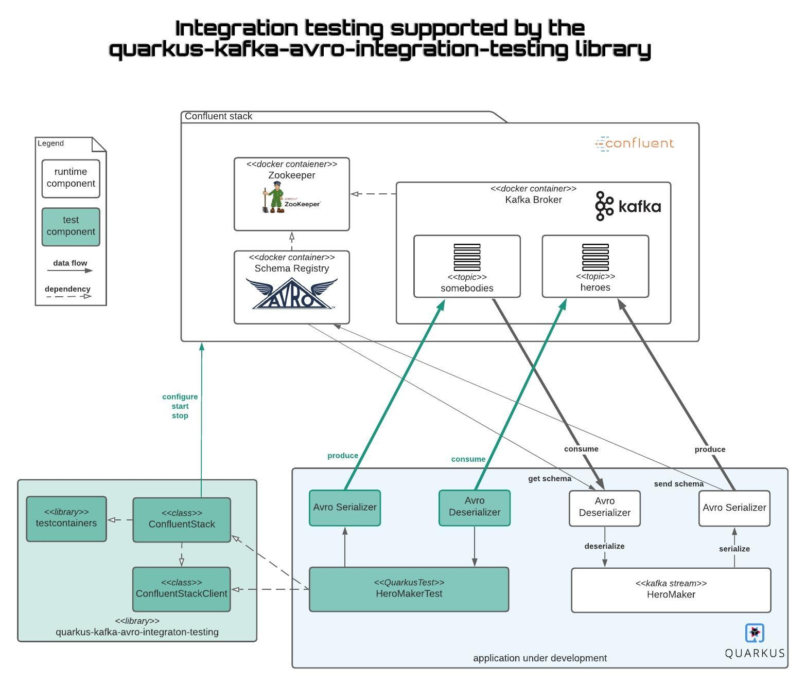

# quarkus-kafka-avro-integration-testing

**A testing library for Quarkus projects implementing Kafka with Avro.**

### Overview



### Example integration-test code:

```java
@QuarkusTest
@QuarkusTestResource(value = ConfluentStack.class)
class ReactiveDonatorExtractorTest {

  ConfluentStackClient testClusterClient;

  @BeforeEach
  void setUp() {
    testClusterClient.createTopics(SOURCE_TOPIC, TARGET_TOPIC);
  }

  @Test
  void shouldExtractADonatorOutOfEveryDonation() throws InterruptedException, ExecutionException, TimeoutException {
    Donation donation = Donation.newBuilder().setPrename("Max").setSurname("Mustermann").build();
    List<Donation> donationToSend = IntStream.range(0, 10).mapToObj(i -> donation).collect(Collectors.toList());

    Future<List<Donator>> receiveFuture = testClusterClient.waitForRecords(TARGET_TOPIC, "testConsumerGroup", donationToSend.size(), StringDeserializer.class);

    testClusterClient.sendRecords(SOURCE_TOPIC, donationToSend, StringSerializer.class, (index, event) -> String.valueOf(index));

    List<Donator> receivedDonators = receiveFuture.get(MAX_CONSUMER_WAIT_TIME, TimeUnit.MILLISECONDS);

    assertThat(receivedDonators).hasSameSizeAs(donationToSend);
  }
}
```

## What does this testing library provide?

### A Quarkus TestResource bootstrapping a complete [Confluent Kafka](https://www.confluent.io/) stack

* including the zookeeper, kafka and a schema registry
* started as docker containers using [testcontainers](https://www.testcontainers.org/)
* automatically overrides config properties
  * for reactive messaging
    * kafka.bootstrap.servers
    * mp.messaging.connector.smallrye-kafka.schema.registry.url
  * for Kafka streams
    * quarkus.kafka-streams.bootstrap-servers
    * quarkus.kafka-streams.schema-registry-url
* version can be customized

### An auto injected client leveraging

* creation and deletion of topics
* registering and deleting schemas
* factory functions for kafka producers and consumers
* high level functions for direct sending and receiving of events
* creation of Kafka admin client
* creation of schema registry client

## How to install?

### add dependency

```xml
<dependency>
    <groupId>de.ippen-digital</groupId>
    <artifactId>quarkus-kafka-avro-integration-testing</artifactId>
    <version>1.1.0</version>
    <scope>test</scope>
</dependency>
```

## How to use?

### Basic: define the kafka stack as testing resource

```java
@QuarkusTest
@QuarkusTestResource(value = ConfluentStack.class)
class YourIntegrationTest {}
```

### Advanced: define the kafka stack with extra ResourceArgs

#### Multiple Boostrap Servers
In case the `incoming` and `outgoing` channels, source topic and target topic are different because they are from different Bootstrap Servers, we need to define extra ResourceArgs in the `@QuarkusTestResource`. Also need to make sure the `ConfluentStackClient` create the same topics accordingly. 
```java
@QuarkusTest
@QuarkusTestResource(
        value = ConfluentStack.class,
        initArgs = {
                @ResourceArg(name = "incoming", value = "mb-source"),
                @ResourceArg(name = "outgoing", value = "mb-target"),
                @ResourceArg(name = "sourceTopic", value = "mb.source-topic"),
                @ResourceArg(name = "targetTopic", value = "mb.target-topic")
        }
)
class YourIntegrationTest {
  private static final String SOURCE_TOPIC = "mb.source-topic";
  private static final String TARGET_TOPIC = "mb.target-topic";

  ConfluentStackClient testClusterClient;

  @BeforeEach
  void setUp() {
    testClusterClient.createTopics(SOURCE_TOPIC, TARGET_TOPIC);
  }
}
```


#### ConfluentStack Versions
Version of the Confluent stack can be customized. Default version is `7.2.1`

```java
@QuarkusTestResource(
        value = ConfluentStack.class, 
        initArgs = {
                @ResourceArg(name = ConfluentStack.CONFLUENT_VERSION_ARG, value = "7.2.1.arm64")
        }
)
```

### Inject the client

Just define the field in the test suite, no annotation needed

```java
public ConfluentStackClient confluentStackClient;
```

### Implement the test code

The consumers created by this library are configured to consume latest emitted events. So side effects of multiple tests within the testsuites can be minimized.

***
***So its is very important to always subscribe the consumer before producing events.***
***

### Examples

The library itself is tested by different scenarios

#### Sample scenario: extract the donators out of donations

Implementation as reactive
messaging: [ReactiveDonatorExtractorTest.java](src/test/java/de/id/quarkus/kafka/testing/reactivemessaging/ReactiveDonatorExtractorTest.java)

Implementation as Kafka streaming
topology: [KStreamsDonatorExtractorTest.java](src/test/java/de/id/quarkus/kafka/testing/kafkastreams/KStreamsDonatorExtractorTest.java)

#### Sample scenario: extract donators by joining the collectors project name and update the balance of the donations collectors

The stream processes the donation events:

* by joining its projectId with the donation collectors projectName and extract the donator with the joined projectName
* by adding the donated amount of money to the donation collectors balance

Implementation as Kafka streaming
topology: [KStreamsDonatorEnrichmentTest.java](src/test/java/de/id/quarkus/kafka/testing/kafkastreams/KStreamsDonatorEnrichmentTest.java)
